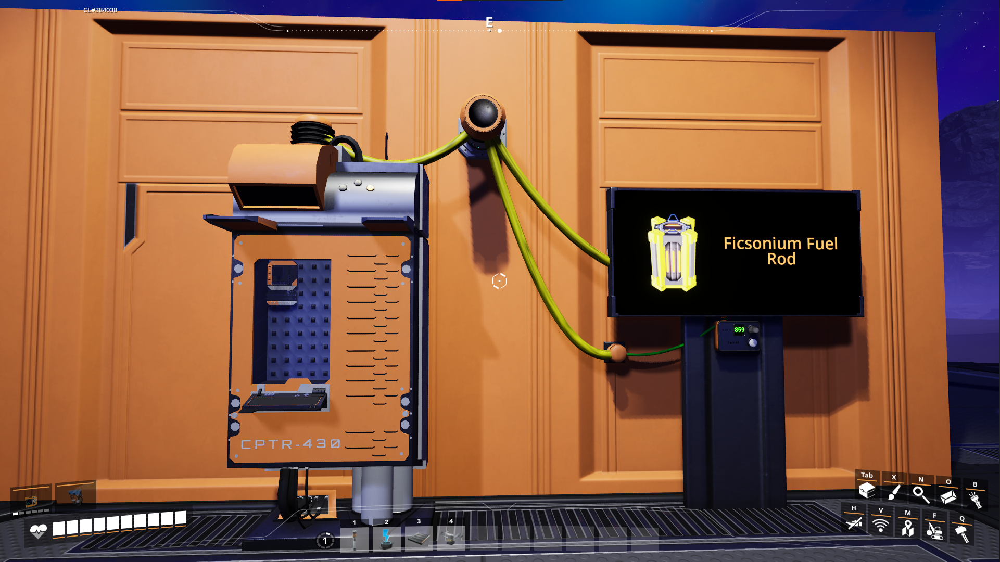
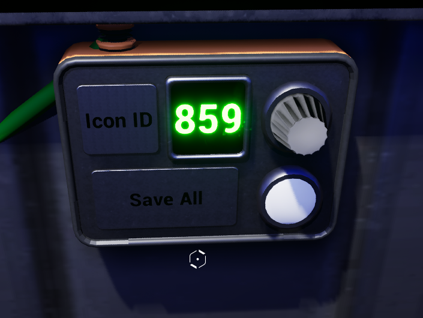
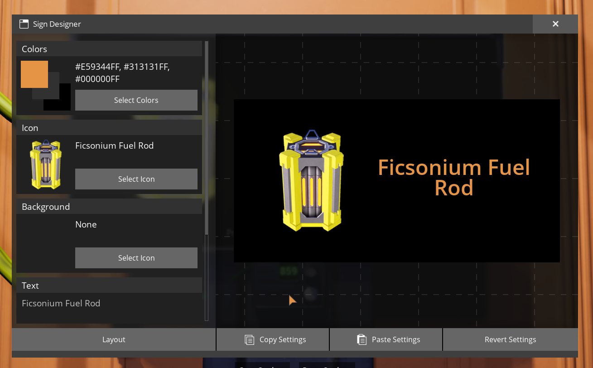

# Satisfactory-Icons

This repository contains lists of Satisfactory icon names and IDs, designed for use with the [FicsIt-Networks](https://github.com/Panakotta00/FicsIt-Networks) mod by [Panakotta00](https://panakotta00.dev). However, they can be utilized for other purposes as desired.

The most interesting file should be [part-equipment.lua](icons/part-equipment.lua), since it contains all IDs for the icons of parts and equipment, indexed by the name. This file is also the only one I cleaned up and removed/commented out the wrong duplicates.

## Files

| File | Description | Index type |
|---|---|---|
| [part-equipment.lua](icons/part-equipment.lua) | Contains all icons categorized as parts or equipment. | Name |
| [all-icons.lua](icons/all-icons.lua) | Lists all IDs with their corresponding names as values. | ID |
| [duplicated-names.lua](icons/duplicated-names.lua) | Identifies names that are duplicated, along with their IDs. | ID |
| [sorted type folder](icons/sorted%20type/) | Contains icons organized by their type. | ID |

## Usage

The files are created to return the table if they are run with the `doFile()` function. This way they can be dropped into the folder of a disk or floppy and then used.

```Lua
local icons = filesystem.doFile("/path/to/part-equipment.lua")

print(icons["Iron Ore"])    -- 193
print(icons["AI Limiter"])  -- 230
```

## Disclaimer

The accuracy of the provided data is not guaranteed.  
There are also many duplicated names.  
The text was extracted with the "Text Extractor" tool which is part of [Microsoft PowerToys](https://github.com/microsoft/PowerToys), I tried to always make sure the pasted text was correct and changed it if I found anything wrong but this means there still could be errors in there I didn't catch.  
Refer to the [Setup](#setup) section for further details.

## Setup

To collect data and ensure it matches what's in Satisfactory, I used a sign and a computer from FicsIt-Networks.

The computer had a floppy disk for saving the data. The code for this setup is available in this repository: [EEPROM Code](src/eeprom.lua) and [the program itself](src/boot/run.lua). The code works but is a quick and dirty solution—don’t take it too seriously.



I connected the computer to the sign and a panel with the following components:
- Square Micro Display: Displays the current ID.
- Encoder: Cycles through the IDs.
- Illuminable Push Button: Saves the collected data to the disk.



To avoid manually entering names, I used [Microsoft PowerToys](https://github.com/microsoft/PowerToys) and its "Text Extractor" tool (Windows key + LShift + T). With a few keyboard macros, I automated the process: opening the sign settings, extracting the current icon's text, and pasting it as the label. The text was then read by the in-game computer and saved to the floppy.


